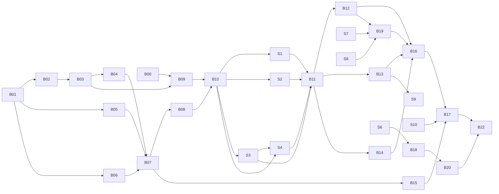

# ArcadeDB RAG Benchmark — Issues

Work breakdown of [`../arcadedb-rag-benchmark-prd.md`](../arcadedb-rag-benchmark-prd.md) following the order in [`../arcadedb-rag-benchmark-handoff.md`](../arcadedb-rag-benchmark-handoff.md) §5, with the deviations listed under *Review notes*. Issues are Markdown files (owner preference: plans live under `plans/`, not as GitHub issues). Tick the status column as work lands.

- **B-issues** — benchmark harness / runs. Branch: `arcadedb-rag-benchmark` (fork-only, never PR'd upstream).
- **S-issues** — store fixes. One branch per issue from `upstream/main`, touching only `embedding-stores/langchain4j-community-arcadedb`; upstream-eligible. Merged into the benchmark branch after landing (or earlier, to benchmark unreleased fixes).

## Scope decision (2026-09-28)

Until all issues are complete, runs are limited to the **`smoke` (100k) and `standard` (1M) tiers**. Everything on the `full` tier (2.68M) — embedding the remaining ~1.68M passages, full-tier ground truth, acceptance 2, the full-tier part of `canonical`, full-tier remote in `extended` — is collected in [B22](B22-full-tier-deferred.md) and done last. Consequences:

- The embedding cache is built **append-only, `standard` ids first**, so extending it to `full` later re-embeds nothing (deviation from PRD F7 "embed the full tier once").
- `canonical` is standard-only for now; wall-time targets (acceptance 5) are re-checked when B22 adds the full tier.
- Acceptance 2 (MTEB nDCG@10 check) needs the full corpus and moves to B22; until then the pipeline is validated by acceptance 3 and 4 only.

## Index

| ID | Title | Phase | Depends on | Status |
|---|---|---|---|---|
| [B00](B00-reference-machine-setup.md) | Reference machine setup | 0 Setup | — | ☐ |
| [B01](B01-module-skeleton.md) | Benchmark module skeleton and build wiring | 1 Smoke path | — | ☐☑ |
| [B02](B02-dataset-loader-and-tiers.md) | BEIR dataset loader, tier sampler, `bucket` metadata | 1 Smoke path | B01 | ☐☑ |
| [B03](B03-embedding-cache.md) | Embedding cache (corpus + queries) | 1 Smoke path | B02 | ☐ |
| [B04](B04-ground-truth.md) | Brute-force ground truth (plain + filtered) | 1 Smoke path | B03 | ☐ |
| [B05](B05-metrics.md) | Metrics library (IR, ANN recall, latency stats) | 1 Smoke path | B01 | ☐ |
| [B06](B06-arcadedb-target-embedded.md) | `BenchmarkTarget` + embedded `ArcadeDbTarget` | 1 Smoke path | B01 | ☐ |
| [B07](B07-runner-smoke-profile-json.md) | Runner, `smoke` profile, JSON results, trivial report | 1 Smoke path | B02–B06 | ☐ |
| [B08](B08-remote-target.md) | Remote (Docker) `ArcadeDbTarget` | 2 Scale-up | B06, B07 | ☐ |
| [B09](B09-standard-embedding-and-ground-truth.md) | Standard-tier embedding cache + ground truth (run) | 2 Scale-up | B00, B03, B04 | ☐ |
| [B10](B10-baseline-unmodified-store.md) | Baseline run on the unmodified store | 3 Baseline | B07, B08, B09 | ☐ |
| [S1](S1-batched-embedded-ingestion.md) | Batched embedded ingestion (+ deferred graph build) | 4 Viability fixes | B10 | ☐ |
| [S2](S2-batched-remote-ingestion.md) | Batched remote ingestion | 4 Viability fixes | B10 | ☐ |
| [S3](S3-correct-remote-top-k.md) | Correct remote top-k | 4 Viability fixes | B10 | ☐ |
| [S4](S4-per-query-efsearch.md) | Per-query `efSearch` | 4 Viability fixes | B10, S3 (remote part) | ☐ |
| [B11](B11-integrate-s1-s4-validate.md) | Integrate S1–S4, validate acceptance 3 | 4 Viability fixes | S1–S4, B09 | ☐ |
| [B12](B12-lexical-scenario.md) | `lexical` scenario | 5 Canonical | B11 | ☐ |
| [B13](B13-filtered-scenario.md) | `filtered` scenario | 5 Canonical | B11 | ☐ |
| [B14](B14-efsearch-sweep-concurrency.md) | efSearch sweep, concurrency, recall-vs-latency | 5 Canonical | B11 | ☐ |
| [B15](B15-compare-report.md) | `compare` command (Markdown + SVG, noise bands, thresholds) | 5 Canonical | B07 | ☐ |
| [S7](S7-expose-hybrid-options.md) | Expose hybrid / full-text options | 5 Canonical | B10 | ☐ |
| [S8](S8-fulltext-query-sanitising.md) | Full-text query sanitising + dense fallback | 5 Canonical | B10 | ☐ |
| [B19](B19-hybrid-variants-and-tuned.md) | `hybrid-variants` sweep → freeze `hybrid-tuned` | 5 Canonical | S7, S8, B12 | ☐ |
| [B16](B16-canonical-profile.md) | `canonical` profile (standard tier) + loaded-DB reuse/cache | 5 Canonical | B12–B14, B19 | ☐ |
| [S10](S10-version-compatibility.md) | Store version compatibility (26.7.2 + latest) | 6 Versions | — | ☐ |
| [B17](B17-version-comparison-run.md) | Version comparison run + report | 6 Versions | B15, B16, S10 | ☐ |
| [S5](S5-remove-scan-fallback.md) | Remove O(N) scan fallback at scale | 7 Extended | B10 | ☐ |
| [S6](S6-expose-index-options.md) | Expose index options (quantization, similarity) | 7 Extended | B10 | ☐ |
| [S9](S9-server-side-filtering.md) | Server-side metadata filtering | 7 Extended | B13 | ☐ |
| [B18](B18-index-grid.md) | `index-grid` scenario | 7 Extended | S6, B16 | ☐ |
| [B20](B20-extended-profile.md) | `extended` profile (standard tier) | 7 Extended | B16, B18, B19 | ☐ |
| [B21](B21-mixed-workload.md) | `mixed` read/write scenario (optional) | 7 Extended | B16 | ☐ |
| [B22](B22-full-tier-deferred.md) | Full-tier runs (deferred) | 8 Full tier | all others | ☐ |

## Dependency sketch

## Review notes (deviations from handoff §5 / open decisions)

1. **`hybrid-tuned` is needed before `canonical` but only produced in step 7.** PRD F14 puts `hybrid-tuned` (and `filtered` with `hybrid-tuned`) in `canonical`, but `hybrid-tuned` comes out of the `hybrid-variants` sweep, which the handoff schedules last (step 7, after the version comparison in step 6). **Decided (2026-09-28): S7, S8 and B19 are pulled forward into phase 5**, so `hybrid-tuned` is frozen before `canonical` (B16) and the version comparison (B17); canonical runs once per version.
2. **Remote baseline must exist before S2/S3 land.** Acceptance 7 needs before/after for S2 and S3, which are remote-only, but handoff §5 adds remote mode in step 5 (after S1–S4). Remote target (B08) is therefore moved before the baseline (B10), and the baseline covers remote at `smoke` tier (results will show S3's wrong top-k — that is the point).
3. **Standard-tier embedding run can start right after B03** rather than after the whole smoke path; it is the longest pole (hours) and independent of the store. B09 is sequenced accordingly. (Full-tier embedding deferred to B22.)
4. **Build wiring:** the ArcadeDB module is only in the reactor via the `jdk21-modules` profile (root `pom.xml:342-349`). The `benchmarks` profile must require JDK 21 as well, and overriding `arcadedb.version` must also rebuild the store module against that version (F13 compile-failure finding), not just swap the runtime jar.
5. **Machines (amended 2026-09-28, PRD §5.1 A2/A3):** reference machine lowered to ≥8 cores / ≥32 GB, so the 8-core / 46 GB box qualifies. While no reference machine is available, early work (B01–B08, B15, S-fixes) may run on a lower-spec development machine (PRD N2a), `smoke` only, results tagged `dev` and never used as baseline or comparison input.
6. **Embedding cache portability (N1):** if embeddings are computed on one machine and copied, accuracy stays identical; recomputing on another CPU may differ in the last float bits. Treat the cache as a checksummed artefact and copy it rather than regenerate.
7. Minor: `searchEmbedded` is `public` (`ArcadeDBEmbeddingStore.java:526`), not private like the other pointers in handoff §7; the 2-arg ANN call is at `:542` as the PRD says. Other line pointers verified at `7de83f5`.
